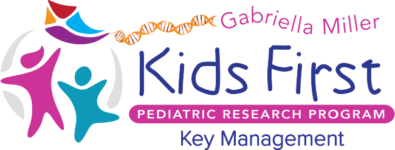

<p align="center">
  
</p>

# Kids First Key Management Lambdas

Springboot application for storing user api tokens from third party services.

## Dev Setup

To run install and run test: `mvn clean install`

To run application on your computer, you need a DynamoDB running:
- Execute `launch.sh` script in docker directory
- Uncomment dynamodb host config in application.yml (be careful with yml, dynamodb needs to be a child of application !)
```
#  dynamodb:
#    endpoint: "http://localhost:8000"
```

You also need a KMS or you can just mock this service if you don't need it for your test.

Also make sure, keycloak configuration is correct.
```
  keycloak:
  realm: "KidsFirst"
  auth-server-url: "http://localhost:8080/auth"
  ssl-required: "external"
  resource: "kf-key-management"
  bearer-only: true
  confidential-port: 0
```

## Methods

 * [Get Secret](#get-secret)
 * [Put Secret](#put-secret)
 * [Delete Secret](#delete-secret)
 * [Cavatica Proxy](#cavatica-proxy)

All methods require a JWT in the Authorization header which can be verified with the public key provided in the configuration. Without a valid token the request will be rejected. The UserID is taken from the `sub` field of the JWT.


### GET SECRET

Retrieve a stored secret for a given `service` . If no key is stored for that user with the mathcing service name then an empty 204 response will be returned.

**Query Params**

| Key        | Value         |
| ---------- | ------------- |
| `service`    | **String**: unique identifier for this service this secret is associated with |

Example: `?service=cavatica`


### PUT SECRET

Encrypt and save a secret. 


**Body**

JSON with the following fields.

| Key        | Value         |
| ---------- | ------------- |
| `service`    | **String**: unique identifier for this service this secret is associated with |
| `secret`    | **String**: value to be encrypted and then stored |

Example:
```$json
{
  "service":"cavatica",
  "secret":"60ebf2b87bba49a2f932c8c7a8daa639"
}
```


### DELETE SECRET

Remove a stored secret. 

**Body**

JSON with the following field.

| Key        | Value         |
| ---------- | ------------- |
| `service`    | **String**: unique identifier for thw service that the secret to be deleted is associated with |


Example:
```$json
{
  "service":"cavatica",
}
```

### CAVATICA PROXY

Send a request to Cavatica using your stored Cavatica key for authentication.

The specific Cavatica API properties need to be provided in the JSON body of this request. The cavatica key will be applied automatically if available, and an error returned if it is not stored.

Cavatica keys can be found for a logged in user [here](https://cavatica.sbgenomics.com/developer#token).

[Cavatica API Documentation](http://docs.cavatica.org/docs/the-api)  


**Body**

JSON with the following fields.

| Key        | Value         |
| ---------- | ------------- |
| `method`    | **String**: HTTP Method to use for the request to cavatica. Allowed values are **GET**, **POST**, **PUT**, **PATCH**, **DELETE**|
| `path`    | **String**: Cavatica API path to request. Do not include version string, but do include the leading slash. The path should also include the query string, if needed. Example: `/projects/username01/test-project` |
| `body`    | **JSON** OR **null**: (*Optional*) Provide the JSON request body. If no request body is required then use the value 'null' or omit this field |

Example:
```$json
{
	"method":"GET",
	"path":"/user",
	"body":null
}
